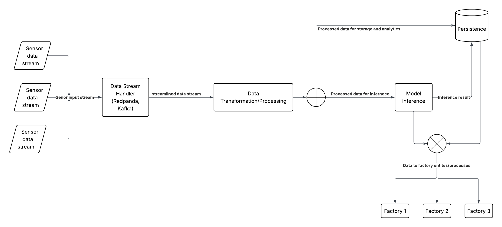

## For the folks at Matta
A very rough sketch out of how I'd start reasoning about the real-time architecture of the backend based on the Backend engineer JD from Matta.

This is a diagram

Everything is placed in one file to serve as a layout of my thoughts

Ideally, The redpanda consumer should be implemented as another service, or another thread

As the diagram shows, all sensors will write to the `/sensor` endpoint and have the data written to the broker

The first consumer (in this case using the spark structure streaming client) reads the data and performs the data transformation/processing

The data is then written back to the broker under a different topic (or preferably directly to the model for inference or the persistence db for analysis)

If inference is carried out on the data, it is also written to storage

The processed data is read from storage and returned to the customer/process/entity that requires the processed information or model inference output

## PS
This is very simplistic, and there are intermediate steps that will need to be implements, but this is a scalable architecture that relies on multiple components that can be developed and run separately and are mostly coupled by their shared data stack.

This was whipped up in ~45 minutes. I'd love to have a conversation if I'm considered for the role. I find the idea of embodied AI truly exciting. Please contact me.